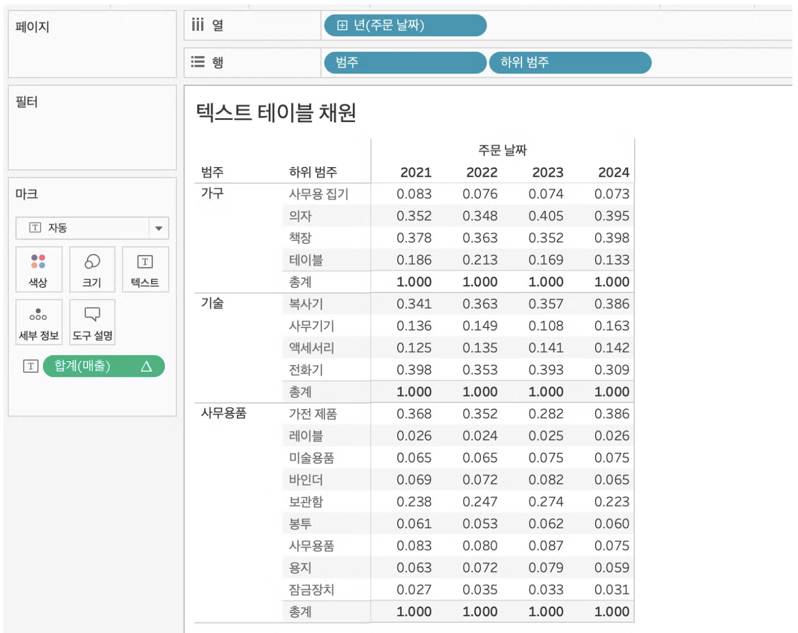
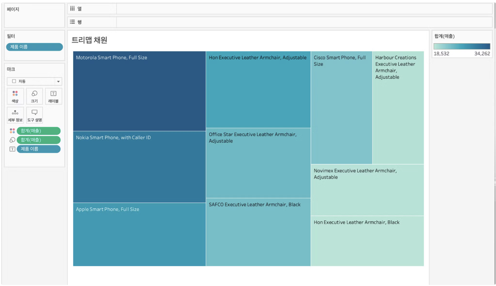
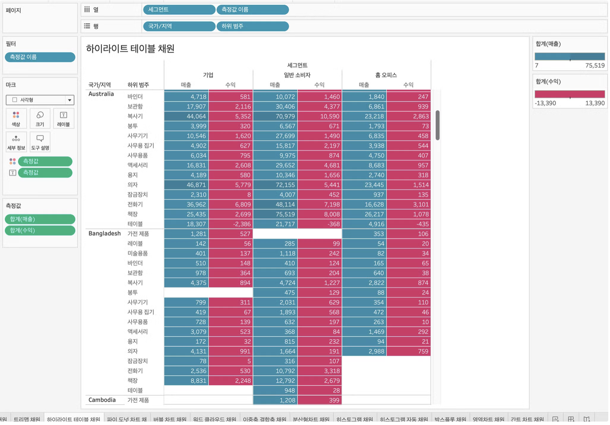

# Second Study Week

- 10강: [차원과 측정값](#10강-차원과-측정값)

- 11강: [시각화](#11강-시각화)

- 12강: [막대그래프](#12강-막대그래프)

- 13강: [누적막대그래프](#13강-누적막대그래프)

- 14강: [병렬막대그래프](#14강-병렬막대그래프)

- 15강: [누적병렬막대그래프](#15강-누적병렬막대그래프)

- 16강: [라인그래프](#16강-라인그래프)

- 17강: [맵작성](#17강-맵작성)

- 18강: [텍스트테이블](#18강-텍스트테이블)

- 19강: [트리맵과 하이라이트테이블](#19강-트리맵과-하이라이트테이블)

- 문제1 : [문제1](#문제1)

- 문제2 : [문제2](#문제2)

- 참고자료 : [참고자료](#참고-자료)


## Study Schedule

| 강의 범위     | 강의 이수 여부 | 링크                                                                                                        |
|--------------|---------|-----------------------------------------------------------------------------------------------------------|
| 1~9강        |  ✅      | [링크](https://youtu.be/3ovkUe-TP1w?si=CRjj99Qm300unSWt)       |
| 10~19강      | ✅      | [링크](https://www.youtube.com/watch?v=AXkaUrJs-Ko&list=PL87tgIIryGsa5vdz6MsaOEF8PK-YqK3fz&index=75)       |
| 20~29강      | 🍽️      | [링크](https://www.youtube.com/watch?v=AXkaUrJs-Ko&list=PL87tgIIryGsa5vdz6MsaOEF8PK-YqK3fz&index=65)       |
| 30~39강      | 🍽️      | [링크](https://www.youtube.com/watch?v=e6J0Ljd6h44&list=PL87tgIIryGsa5vdz6MsaOEF8PK-YqK3fz&index=55)       |
| 40~49강      | 🍽️      | [링크](https://www.youtube.com/watch?v=AXkaUrJs-Ko&list=PL87tgIIryGsa5vdz6MsaOEF8PK-YqK3fz&index=45)       |
| 50~59강      | 🍽️      | [링크](https://www.youtube.com/watch?v=AXkaUrJs-Ko&list=PL87tgIIryGsa5vdz6MsaOEF8PK-YqK3fz&index=35)       |
| 60~69강      | 🍽️      | [링크](https://www.youtube.com/watch?v=AXkaUrJs-Ko&list=PL87tgIIryGsa5vdz6MsaOEF8PK-YqK3fz&index=25)       |
| 70~79강      | 🍽️      | [링크](https://www.youtube.com/watch?v=AXkaUrJs-Ko&list=PL87tgIIryGsa5vdz6MsaOEF8PK-YqK3fz&index=15)       |
| 80~89강      | 🍽️      | [링크](https://www.youtube.com/watch?v=AXkaUrJs-Ko&list=PL87tgIIryGsa5vdz6MsaOEF8PK-YqK3fz&index=5)        |


<!-- 여기까진 그대로 둬 주세요-->
<!-- 이 안에 들어오는 텍스트는 주석입니다. -->

# Second Study Week

## 10강: 차원과 측정값

<!-- 차원과 측정값에 관해 배우게 된 점을 적어주세요 -->

> **🧞‍♀️ 차원과 측정값의 고유한 특성에 대해 설명해주세요.**

```
데이터 유형에 따라 필드를 차원 또는 측정값으로 할당하는 것은 태블로이다.

차원은 정성적인 값. 집계되거나 개선되지 않는 독립적인 불연속형 필드. 파란색.

측정값은 정량적인 수치 값. 차원의 세부 항목. 집계될 수 있는 연속형 필드. 녹색.
```

*Quiz: 차원은 불연속형이고, 측정값은 연속형이다 (o, x)* 

-> X

주의할 점: 차원은 불연속, 측정값은 연속형. 이렇게 2분법 적으로 생각하면 안 됨. 활용 가능. 차원이 연속형이 될 수 있고, 측정값도 불연속형이 될 수 있다.


## 11강: 시각화

<!-- 시각화 관해 배우게 된 점을 적어주세요 -->
```
데이터 필드를 시트에 추가하는 방법은 여러가지가 있음. 
더블 클릭, 열 또는 행 선반으로 드래그 앤 드롭, 컨트롤 키 이용해서 클릭.

시트의 오른 쪽 상단 표현 방식에서 시각화 방법 변환 가능.

마크 창에 원하는 필드 드래그를 통해 시각화에 활용 가능.
```


*Quiz: 차원은 대부분 불연속형이며 표 형태로 시각화했을 때 머리글로 표시되고, 측정값은 대부분 연속형이므로 표 형태로 시각화 진행했을 때 패널로 추가된다.(o, x)*

-> X

## 12강: 막대그래프

<!-- 막대그래프에 관해 배우게 된 점을 적어주세요 -->
막대그래프 행렬 바꾸기, 뷰 바꾸기, 정렬 바꾸기, 색상 바꾸기

색상 바꾸기는 마크에서 선택 가능.

마크 탭에 레이블로 드래그앤 드롭하면 원하는 값을 텍스트로 나타낼 수 있음.

마크 창의 크기를 통해서 그래프의 굵기 조정 가능.


## 13강: 누적막대그래프

<!-- 누적막대그래프에 관해 배우게 된 점을 적어주세요 -->
마크 탭의 세부 정보를 이용해서 누적 막대그래프를 나타낼 수 있음.

열, 행 선반에 있는 필드의 오른 쪽 역삼각형을 통해 측정값을 백분율 형태로 바꿀 수 있음.

선반 위 필드의 오른 쪽 역삼각형에서 다음을 사용해서 계산에 테이블(아래로) 선택시 카테고리 내의 백분율 계산 가능.

열, 행 선반의 필드에 +,- 버튼을 활용해서 세분화 가능.


<!-- 테이블(아래로)와 테이블(옆으로)의 계산 방식을 습득해보세요. 이에 관련해 아래 참고자료도 있습니다 :) -->

## 14강: 병렬막대그래프

<!-- 병렬막대그래프에 관해 배우게 된 점을 적어주세요 -->
병렬 그래프에서는 날짜 형태를 연속형으로 바꾸어주어야 함. 단, 연도별 병렬 그래프에서는 큰 차이가 없음.


> *🧞‍♀️ 끊어진 색상으로 배치되어 표현되는 경우와 이어지는 그라데이션 색으로 표현되는 경우 두 가지가 있습니다. 위 사진의 경우 왜 색깔이 끊어지는 색상으로 표시되지 않고 그라데이션으로 표시되었나요? 데이터의 특성과 관련하여 이야기해 봅시다.*

```
여기에 답을 적어주세요!
```

## 15강: 누적병렬막대그래프

<!-- 누적병렬막대그래프에 관해 배우게 된 점을 적어주세요 -->
이중축: 하나의 축에 두 개의 그래프를 나타내는 것. 선반에서 필드의 오른쪽 역삼각형에서 선택 가능.


> *🧞‍♀️ 위 사진에서는 Profit과 Sales를 측정값으로 두었습니다.  개별 칼럼(태블로에서는 #필드라 명칭합니다)을 열/행에 두는 대신, '측정값'을 사용하고 측정값 선반에 필드를 올려둡니다. 이런 방식을 사용하는 이유가 무엇일지, 어떻게 사용할 수 있을지 고민해보세요*

```
여기에 답을 적어주세요!
```

<!-- 정답은 없습니다 -->

## 16강: 라인그래프

<!-- 라인그래프에 관해 배우게 된 점을 적어주세요 -->
라인그래프: 데이터의 시간별 추세를 확인하거나 해당 데이터를 통해 미래 값을 예측하려는 경우에 많이 사용됨.

태블로는 열 선반에 날짜 필드가 있으면 자동으로 라인차트를 완성함.

이중축을 사용했을 때 세로 축이 두 개라서 혼동을 줄 경우 둘 중 하나의 축을 우클릭해서 축 동기화를 해주면 하나의 축으로 나타낼 수 있다.


## 17강: 맵작성

<!-- 맵차트 관해 배우게 된 점을 적어주세요 -->
맵에서 위치 편집을 클릭하고, 지역 설정을 변경할 수 있다.

마크 계층: 고유한 마크, 캡션, 색상을 가질 수 있다.

‘주’를 더블클릭하고 ‘도시’를 드래그하면 마크 계층 추가 가능.

마크 계층을 추가하면, 계층 별로 서로 다른 값들을 시각화해서 볼 수 있음.

```js
## 참고
Country/Region - 나라/지역
State/Province - 시/도
City - 시
County - 군
Postal Code - 우편번호
Area Code - 지역 코드
Airport - 공항
MSA/CBSA (Metropolitan Statistical Area) - 광역 통계 지역
Longitude - 경도
Latitude - 위도
```

## 18강: 텍스트테이블

<!-- 텍스트테이블에 관해 배우게 된 점을 적어주세요-->
마크탭에서 우클릭, 다음으로 계산 → 테이블(아래로), 패널(아래로) 뭘 선택하는지에 따라, 전체 테이블에서 구성비율을 혹은 범주 별 구성 비율 확인할 수 있음. 


## 19강: 트리맵과 하이라이트테이블

트리맵으로 나타내려면, 나타내려는 건 마크탭의 텍스트에, 나타내고자하는 값은 색상과 크기에, 필터를 걸어서 상위 10개 등으로 나타낼 숫자를 조절하는 것이 중요.

하이라이트 테이블도 비슷하고, 원하는 걸 열, 행에 넣고, 마크탭에서 조절하면 됨. 범례 조절을 통해 색깔 조정 가능.




> *🧞‍♀️하이라이트 테이블 등에서 두개 이상의 측정값을 사용하는 경우, 함께 색을 표현하게 되면 단위가 달라 정확한 값을 표현할 수 없습니다. 이때 클릭해야 하는 항목은?*

```
여기에 답을 적어주세요!
```


## 문제1

```js
지민이는 superstore의 한국 수출 관리 업무를 맡고 있습니다. 국가/지역이 우리나라, 즉 'South Korea'인 데이터만을 필터링하여, 상품 하위범주 별로 각 하위범주가 매출의 비율 중 얼마만큼을 차지하는지를 트리맵으로 확인하고 싶습니다. 트리맵의 각 네모 안에 표시되는 텍스트에는 **해당 범주의 이름과 전체에서 해당 범주가 차지하는 비율**이 표시되었으면 합니다.

지민이를 도와주세요! (풀이를 찾아가는 과정을 기술해주세요)
```

```
여기에 답을 적어주세요!
```

## 문제2

```js
주현이는 국가/지역별로 매출과 수익의 증감을 시간에 흐름에 따라 표현하고자 합니다. 특히 **한국/중국/일본**을 비교하고자 해당 3국을 남기고 필터링했고, 3개 국가를 매출과 수익이라는 두 가지 지표로 확인해보았습니다.

아래는 위 설명을 표현해본 예시입니다.
```


```js
레퍼런스와 꼭 같지 않아도 자유롭게 표현하고, 그 과정을 기술해주세요.
```

```
여기에 답을 적어주세요!
```

### 참고 자료

```js
테이블 계산에서 '다음을 사용하여 계산'에는 테이블 당 계산과 패널 당 계산이 있습니다. 이에 대해 이해하는 것이 꼭 필요하기 때문에, 외부 레퍼런스를 참고하여 이 단계에서 꼭! 학습 후, 넘어가주세요 :)
```


[참고 외부자료 링크는여기를클릭하십시다](https://velog.io/@eunsuh/Tableau-%EB%A0%88%EB%B2%A8UP-%EA%B0%95%EC%9D%98-%EC%A0%95%EB%A6%AC-1-%ED%85%8C%EC%9D%B4%EB%B8%94-%EA%B3%84%EC%82%B0)

