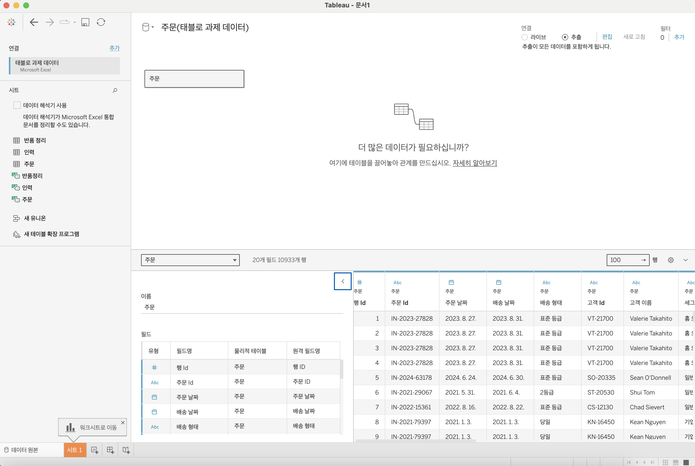
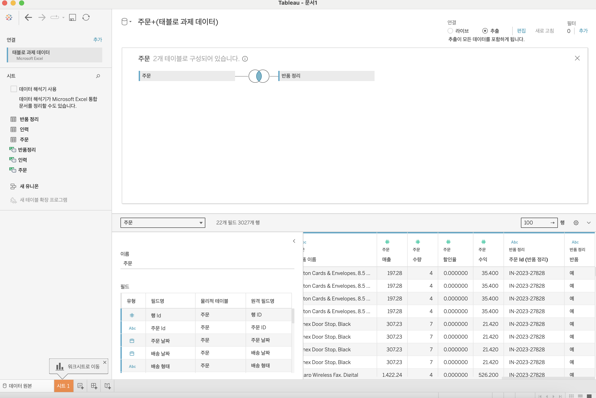
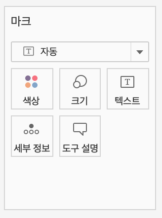
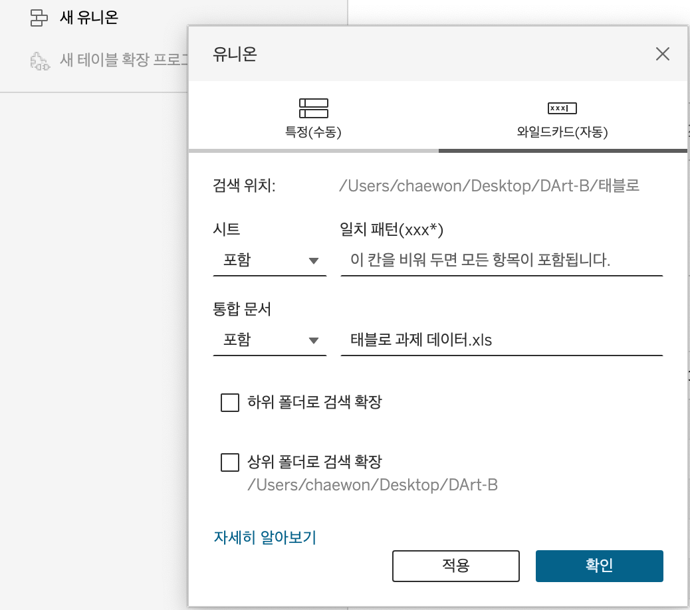

# First Study Week

- 1강: [태블로설치](#1강-태블로설치)

- 2강: [데이터연결](#2강-데이터연결)

- 3강: [데이터연결과 데이터유형](#3강-데이터연결과-데이터유형)

- 4강: [데이터결합과 관계](#4강-데이터결합과-관계)

- 5강 : [데이터결합과 조인](#5-데이터결합과-조인)

- 6강: [데이터결합 혼합](#6강-데이터결합-혼합)

- 7강: [데이터결합과 유니온](#7강-데이터-결합과-유니온)

- 8강: [라이브 및 추출](#8강-라이브-및-추출)

- 9강: [데이터형식](#9강-데이터형식)

- 문제1 : [문제1](#문제-1)

- 문제2 : [문제2](#문제-2)

- 참고자료 : [참고자료](#참고-자료)


## Study Schedule

| 강의 범위     | 강의 이수 여부 | 링크                                                                                                        |
|--------------|---------|-----------------------------------------------------------------------------------------------------------|
| 1~9강        |  ✅      | [링크](https://youtu.be/3ovkUe-TP1w?si=CRjj99Qm300unSWt)       |
| 10~19강      | 🍽️      | [링크](https://www.youtube.com/watch?v=AXkaUrJs-Ko&list=PL87tgIIryGsa5vdz6MsaOEF8PK-YqK3fz&index=75)       |
| 20~29강      | 🍽️      | [링크](https://www.youtube.com/watch?v=AXkaUrJs-Ko&list=PL87tgIIryGsa5vdz6MsaOEF8PK-YqK3fz&index=65)       |
| 30~39강      | 🍽️      | [링크](https://www.youtube.com/watch?v=e6J0Ljd6h44&list=PL87tgIIryGsa5vdz6MsaOEF8PK-YqK3fz&index=55)       |
| 40~49강      | 🍽️      | [링크](https://www.youtube.com/watch?v=AXkaUrJs-Ko&list=PL87tgIIryGsa5vdz6MsaOEF8PK-YqK3fz&index=45)       |
| 50~59강      | 🍽️      | [링크](https://www.youtube.com/watch?v=AXkaUrJs-Ko&list=PL87tgIIryGsa5vdz6MsaOEF8PK-YqK3fz&index=35)       |
| 60~69강      | 🍽️      | [링크](https://www.youtube.com/watch?v=AXkaUrJs-Ko&list=PL87tgIIryGsa5vdz6MsaOEF8PK-YqK3fz&index=25)       |
| 70~79강      | 🍽️      | [링크](https://www.youtube.com/watch?v=AXkaUrJs-Ko&list=PL87tgIIryGsa5vdz6MsaOEF8PK-YqK3fz&index=15)       |
| 80~89강      | 🍽️      | [링크](https://www.youtube.com/watch?v=AXkaUrJs-Ko&list=PL87tgIIryGsa5vdz6MsaOEF8PK-YqK3fz&index=5)        |


<!-- 여기까진 그대로 둬 주세요-->


## 1강. 태블로설치


<!-- 태블로 Desktop은 유료 혹은 사용자 인증이 되어야 하므로, 사용 경험이 없으시다면 우선 Tableau Public으로 학습하는 것을 권장드립니다. -->


## 2강. 태블로연결


> **🧞‍♀️ 데이터 해석기는 어떤 경우 사용하나요?**

```
데이터해석기는 병합된 셀, 메모, 바닥글, 빈 셀 등을 감지하고, 이를 무시하여 데이터 집합의 실제 필드와 값을 식별할 수 있게 하는 기능.
데이터 관리시 태블로가 읽기 쉽도록 해야하는데 그렇지 않은 경우 사용 가능.
즉, 데이터 해석기는 태블로가 자동으로 데이터의 패턴과 트렌드를 식별하고, 이를 기반으로 유용한 시각적 인사이트를 제공하는 도구.
```


> **🧞‍♀️ 깃허브 assignment 폴더의 DArt-B Sample Store.xls 파일을 다운받고 시트 중 '주문' 시트를 불러와주세요.**
> 

<!-- 캡쳐 파일을 첨부해주세요! 캡쳐하는 법은 깃허브 강의 영상에 있습니다 (폴더 생성 후 폴더 안에 이미지 넣기 + 불러오기) -->


<!-- 문제와 문제 풀이가 모두 위 DArt-B Sample Store.xls 파일을 기반으로 제시되므로, 해당 엑셀파일을 사용하셔야 혼동이 없습니다. -->


## 3강. 데이터연결과 데이터 유형


> **🧞‍♀️ 라이브와 추출의 차이가 무엇인가요? 어떤 경우 사용하나요?**


```
라이브: 원본데이터가 변경될 때 데이터베이스의 기본 데이터를 쿼리한다. 사전 처리를 위해 서버에 데이터가 복사되지 않고 데이터베이스에서 모든 과정이 처리. 성능에따라 통합문서의 속도가 달라짐.

추출: 일정 시간마다 데이터가 새로 업데이트 되는 정적인 방법. 작업 시에 모든 데이터가 데이터 원본에서 태블로 서버로 복사됨. 데이터 원본이 바뀌어도 시각화에 영향을 미치지 않고 추출을 새로 고쳐야함. 집계에 최적화. 대규모 데이터 등 복잡한 시각화에서 훨씬 빠름.
```


## 4강. 데이터결합과 관계

<!-- 데이터 결합과 관계에 대해 알게 된 점을 자유로이 적어보세요.-->

> **🧞‍♀️ 어떤 경우에 관계를, 어떤 경우에 조인을 사용하나요?**

```
관계: 조인보다 동적이고 유연하게 테이블 연결. 
-> 원본 데이터를 조금 더 독립적으로 활용 가능. 결합하려는 데이터 간의 유형이 동일해야 함. 
즉, 동일한 필드가 존재할 때 관계로 테이블 연결 가능.
ex. 주문과 반품 테이블을 관계로 연결하면 두 테이블은 독립적이므로, 유연한 사용 가능하기에 권장하는 결합법.

조인: 제어 혹은 의도적인 필터링, 복제를 위해 조인으로 데이터 결합하는 경우 있음. 
조인으로 결합을 위해서는 테이블의 물리적 계층을 열어야 함. 필드에 있는 주문 테이블 더블클릭 혹은 우클릭 후 열기를 통해 테이블 열 수있음. 테이블 연 이후 반품 테이블 끌어오면 조인이 형성됨.
```


## 5강. 데이터결합과 조인

<!-- 데이터 결합과 조인에 대해 알게 된 점을 적고, 아래 질문에 답해보세요 :) -->

주문 중 '반품된' 주문만을 가지고 분석을 진행하려고 합니다.

> **🧞‍♀️ 해당 목적 달성을 위해서 Sample store 데이터셋의 어떤 시트를 조인(혹은 릴레이션)해야 할까요? 조인키는 무엇인지, (inner, outer, left, right) 조인 유형은 무엇일지 논의해주세요.**

```
inner join을 사용해야 함! 
주문 중에서 반품된 주문이므로, 주문 테이블과 반품 테이블의 '교집합' 부분을 분석하고자 하는 것임.
inner: 교집합, outer: 합집합을 생각하면 됨!
```
데이터를 조인한 데이터 원본 창의 캡쳐를 첨부해주세요.
몇 개의 주문이 반품되었다고 표시되나요? -> 3027

<!-- 캡쳐 이미지를 첨부해주세요 -->


## 6강. 데이터결합 혼합

<!-- 데이터결합 및 혼합에 대해 알게 된 점을 적어주세요 -->
```
혼합의 경우 관계나 조인과 달리 데이터를 실제로 결합하지는 않고, 데이터 원본을 각각 독립적으로 결과 집계한 이후, 한 시트에서 시각화 해서 나타내는 것임.
ex.
1. 처음 데이터 원본에서는 주문 테이블을 끌고옴.
2. 상단의 데이터 탭에서 새 데이터 원본 클릭하고 이 때는 반품 테이블을 끌고 옴.
-> 데이터 원본이 2개임. 
3. 주문 테이블의 지역을 열 선반에 놓고, 테이블을 반품으로 바꿈. 
4. 이후, 주문 id를 반폼 테이블의 마크 창 텍스트에 놓으면
-> 서로 다른 원본 데이터를 한 시트 안에 나타낼 수 있음. 

```


## 7강. 데이터 결합과 유니온

<!-- 유니온에 대해 알게 된 점을 적어주세요 -->

> **🧞‍♀️ 유니온을 사용하기 위한 전제 조건은 무엇인가요?**

``` 
유니온: 한 테이블의 행을 다른 테이블에 추가하여 데이터를 결합하는 방법.
사용 전제 조건: 테이블 구조가 동일해야 함. (각 테이블의 필드 수, 관련 필드의 필드 이름과 데이터 유형도 일치해야 함.)

사용 방법
1. 데이터 원본 페이지에서 새 유니온 클릭 후 테이블 끌어오거나, 
2. 테이블 하나를 시트로 끌어오고 유니온 하고자 하는 테이블을 처음 테이블 바로 밑으로 끌어오면 유니온 가능. -> 밑에 행 수가 2배가 됨.(같은 테이블 유니온 시)
3. 여러 테이블 한 번에 유니온하고 싶은 경우 와일드카드 사용하기. (거기서 일치패턴 생성. ex. 포함 란에 'O*' 입력 시, 'O'로 끝나는 모든 문자열)
```

## 8강. 라이브와 추출



<!-- 마크카드에 대해 알게 된 점을 적어주세요 -->

> **🧞‍♀️ 라이브와 추출 방법의 차이가 무엇인가요? 어떤 경우에 추출을 사용하면 좋을까요?**
```
태블로에서 라이브(Live)와 추출(Extract) 데이터 연결 방법은 데이터 소스와의 연결 방식에 따라 다르다.

* 라이브 연결: 태블로가 실시간으로 데이터 소스에 직접 연결하여 최신 데이터를 조회하는 방법.

장점: 실시간 데이터로 데이터가 변경될 때마다 자동으로 업데이트되므로 항상 최신 정보를 제공. -> 데이터의 정확성과 일관성을 유지할 수 있습니다.

단점: 대용량 데이터 소스와의 실시간 연결은 성능 저하를 초래할 수 있음. -> 데이터가 많거나 복잡할 경우 대시보드의 반응 속도가 느려질 수 있고, 네트워크 상태에 따라 연결이 불안정할 수 있음.


* 추출 연결: 데이터 소스에서 데이터를 추출하여 태블로의 로컬 파일에 저장하고, 이 추출된 데이터를 사용하여 분석하는 방법. 

장점: 데이터를 로컬 파일로 저장 -> 분석 속도가 빠르고, 대용량 데이터를 효율적으로 처리할 수 있음. 또한 오프라인 상태에서도 분석 가능. 추출된 데이터는 데이터 원본을 변경하지 않고도 필요한 형식으로 변형할 수 있음.

단점: 데이터가 추출 시점 이후로 업데이트되지 않으므로, 최신 데이터가 반영되지 않을 수 있고, 대용량 데이터의 경우 추출 파일의 크기가 커져서 저장 공간을 차지할 수 있음.


* 추출 사용이 유리할 때
- 대용량 데이터 혹은 복잡한 쿼리를 사용하더라도 빠른 응답 속도를 원할 때.
- 데이터 소스에 실시간으로 접근할 수 없어 오프라인으로 작업하고 싶을 때.
- 원본 데이터와 별개로 데이터 필터링, 집계, 계산 등 데이터 변형을 적용하여 분석할 때.
```


**참고자료 : 온프레미스 데이터란?**

기업이나 조직이 자체적으로 보유한 물리적 서버나 데이터 센터 내에서 직접 관리하는 데이터로, 조직 내의 하나 이상 서버에서 통제됩니다. 본 서버들은 기업의 데이터센터나 물리적 위치에 설치되어 있으며, 네트워크를 통해 해당 데이터에 접근하고 관리할 수 있습니다.


## 9강. 데이터형식

<!-- 데이터형식에 대해 알게 된 점을 적어주세요 -->
필터: 데이터 원본 페이지 오른 쪽 상단에서 추가, 편집, 삭제 가능.

#: 실수, 정수, 문자형

달력 모양: 날짜, 시간 필드

Abc: 문자열

T|F: bool 형

지구본: 지리적 역할

데이터 형식은 변경 가능. (ex. 20200724은 정수가 아니고 날짜.)


## 문제 1.

용웅이는 아래 사진과 같이 2024년 3월부터 7월까지의 지하철 승하차 이용객 데이터를 가지고 있습니다. 월별로 데이터셋이 나누어진 상태며, 용웅이는 해당 데이터셋 5개 모두를 한 번에 시각화하려 합니다. 필드 값(컬럼)의 이름, 데이터 유형, 개수는 모두 같습니다.


 이때, '조인, 관계, 혼합, 유니온' 중 본 목적에 적합한 결합 방법은 무엇인가요? 하나씩 드래그하지 않고, 와일드카드를 이용해 모든 데이터를 빠르게 결합해보세요.

<!-- 텍스트 및 이미지로 문제 풀이 과정을 기술해주세요 -->


```
-> '유니온' 필드 값의 이름이나 데이터 유형, 개수가 모두 같기에 유니온을 사용할 수 있는 전제조건은 만족. 

여러 테이블 한 번에 빠르게 유니온하고 싶은 경우 와일드카드 사용하기. (거기서 일치패턴 생성. ex. 포함 란에 'O*' 입력 시, 'O'로 끝나는 모든 문자열)
```
## 문제 2.

상원이는 태블로를 사용하여 회사의 매출 데이터를 시각화하려고 합니다. 태블로에서는 데이터를 연결하는 두 가지 방식인 **라이브 연결과 추출 연결**이 있습니다. 두 방식 중 어떤 것을 사용할지 고민 중입니다.

다음의 일상생활 사례를 바탕으로, 어떤 상황에서 라이브 연결이 적합하고, 어떤 상황에서 추출 연결이 더 적합한지 설명하세요.

1. 사례 1: 실시간 주식 시세 확인
주식 거래를 하고 있는 수금의왕 상원이는 주식 시세가 매 순간 변동하는 실시간 데이터를 필요로 합니다. 이 데이터를 기반으로 빠르게 결정을 내려야 합니다.


```
여기에 답을 적어주세요!
```


2. 사례 2: 상원이는 저번 주 제주도로 여행을 갔었어요. 비행 중에 예산 계획을 세우려 하는데, 인터넷 연결이 불안정할 것 같아요. 여행 전 미리 예산 데이터를 다운로드해서 오프라인에서도 사용할 수 있으면 좋겠습니다.

```
여기에 답을 적어주세요!
```

## 참고 자료

데이터 분석을 하다보면 지역별로 경향을 알아보고자 할 때가 많습니다.

태블로에서는 시/도, 시군구명을 칼럼으로 가지고 있고, 그걸 지리적 위치로 바꿔주면 지도에서 위치를 인식하는데요.
하지만 읍면동(행정동) 단위까지 인식하지는 못합니다.

그럼 어떻게 읍면동 단위까지 세분화하여 표기할 수 있을까요?

이때 방금 배운 데이터 릴레이션 혹은 조인을 사용합니다.
맵 그래프는 지금 배울 부분은 아니지만, 데이터 병합에 관련된 부분이기에 필요하신 분들을 위해 아래 링크를 걸어두겠습니다.


바로 읍면동의 경계를 가지고 있는 shp, geojson 등 공간파일을 원본데이터와 머지하는 것입니다.

링크: https://subinze.tistory.com/m/2


[def]: ../image_w1/주문시트.png
[def2]: image_w1/marktab.png
