# Third Study Week

- 20강: [파이와 도넛차트](#20강-파이와-도넛차트)

- 21강: [워드와 버블차트](#21강-워드와-버블차트)

- 22강: [이중축과 결합축](#22강-이중축과-결합축)

- 23강: [분산형 차트](#23강-분산형-차트)

- 24강: [히스토그램](#24강-히스토그램)

- 25강: [박스플롯](#25강-박스플롯)

- 26강: [영역차트](#26강-영역차트)

- 27강: [간트차트](#27강-간트차트)

- 28강: [필터](#28강-필터)

- 29강: [그룹](#29강-그룹)


- 문제1 : [문제1](#문제1)

- 문제2 : [문제2](#문제2)

- 참고자료 : [참고자료](#참고-자료)


## Study Schedule

| 강의 범위     | 강의 이수 여부 | 링크                                                                                                        |
|--------------|---------|-----------------------------------------------------------------------------------------------------------|
| 1~9강        |  ✅      | [링크](https://youtu.be/3ovkUe-TP1w?si=CRjj99Qm300unSWt)       |
| 10~19강      | ✅      | [링크](https://www.youtube.com/watch?v=AXkaUrJs-Ko&list=PL87tgIIryGsa5vdz6MsaOEF8PK-YqK3fz&index=75)       |
| 20~29강      | ✅      | [링크](https://www.youtube.com/watch?v=Qcl4l6p-gHM)      |
| 30~39강      | 🍽️      | [링크](https://www.youtube.com/watch?v=e6J0Ljd6h44&list=PL87tgIIryGsa5vdz6MsaOEF8PK-YqK3fz&index=55)       |
| 40~49강      | 🍽️      | [링크](https://www.youtube.com/watch?v=AXkaUrJs-Ko&list=PL87tgIIryGsa5vdz6MsaOEF8PK-YqK3fz&index=45)       |
| 50~59강      | 🍽️      | [링크](https://www.youtube.com/watch?v=AXkaUrJs-Ko&list=PL87tgIIryGsa5vdz6MsaOEF8PK-YqK3fz&index=35)       |
| 60~69강      | 🍽️      | [링크](https://www.youtube.com/watch?v=AXkaUrJs-Ko&list=PL87tgIIryGsa5vdz6MsaOEF8PK-YqK3fz&index=25)       |
| 70~79강      | 🍽️      | [링크](https://www.youtube.com/watch?v=AXkaUrJs-Ko&list=PL87tgIIryGsa5vdz6MsaOEF8PK-YqK3fz&index=15)       |
| 80~89강      | 🍽️      | [링크](https://www.youtube.com/watch?v=AXkaUrJs-Ko&list=PL87tgIIryGsa5vdz6MsaOEF8PK-YqK3fz&index=5)        |


<!-- 여기까진 그대로 둬 주세요-->
<!-- 이 안에 들어오는 텍스트는 주석입니다. -->

# Third Study Week

## 20강: 파이와 도넛차트
<!-- 파이와 도넛차트에 관해 배우게 된 점을 적어주세요 -->

> **🧞‍♀️ 도넛차트를 생성하는 법을 기록해주세요.**
```
파이차트는 표현 방식에서 선택하면 간단하게 만들 수 있음.

도넛차트 만들기위해서 이중 축을 이용하는데, 
처음에 열 선반에 임의로 우클릭해서 0이라는 축 설정 해주고 
컨트롤 누른 채로 파이차트 복사 후 
마크탭 활용해서 크기 및 레이블 조절 후 이중축. 
→ 도넛 차트 완성.

그 후 서식 조절해서 깔끔하게 만들면 끝!!
```
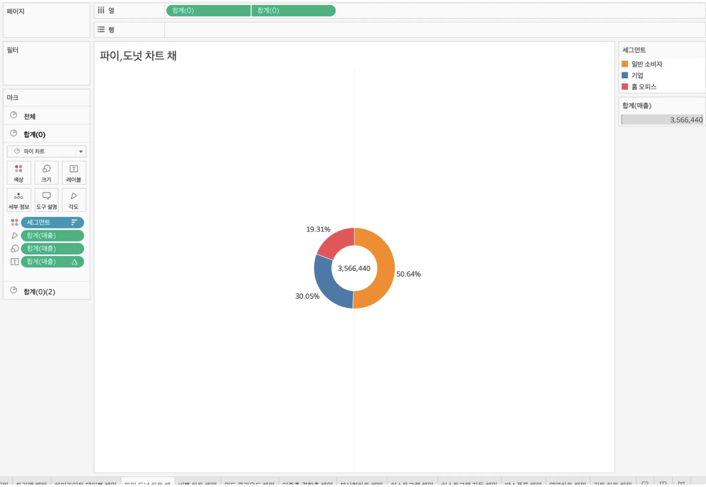

## 21강: 워드와 버블차트
<!-- 워드와 버블차트에 관해 배우게 된 점을 적어주세요 -->
```
버블차트도 표현 방식에서 선택해주면 끝. 마크탭에 색상 이용하면 조금 더 효과적인 시각화 가능.
```
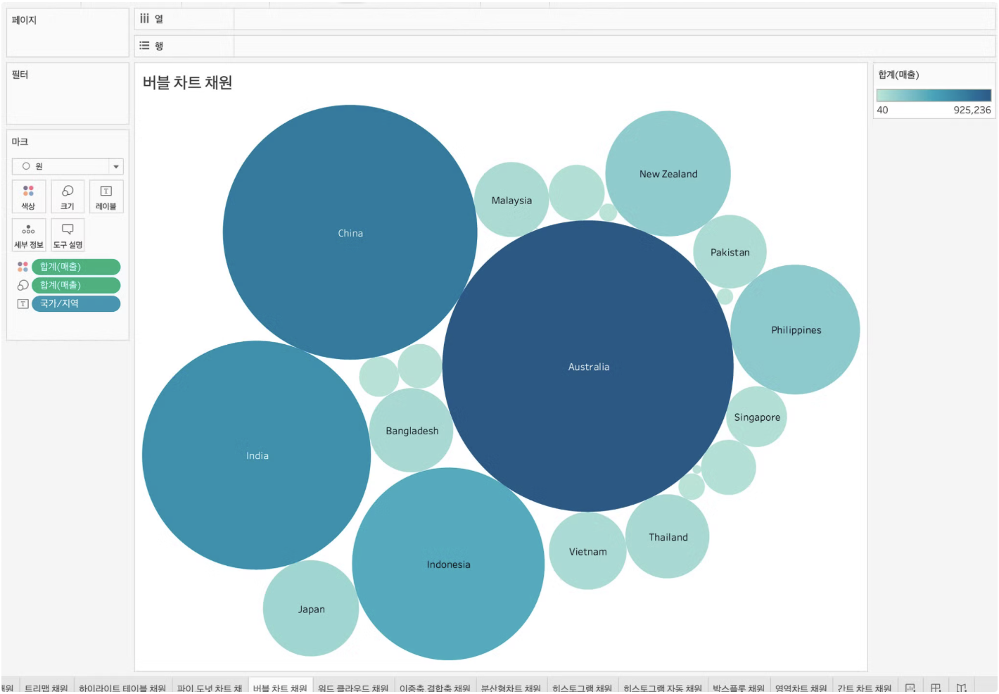
```
워드 클라우드는 크기에서 측정값을 카운트로 설정하고, 레이블에 원하는 항목을 넣으면 됨. 마크에서 자동을 텍스트로 바꾸면 워드 클라우드 완성. 색상을 통해서도 시각화 가능.
```
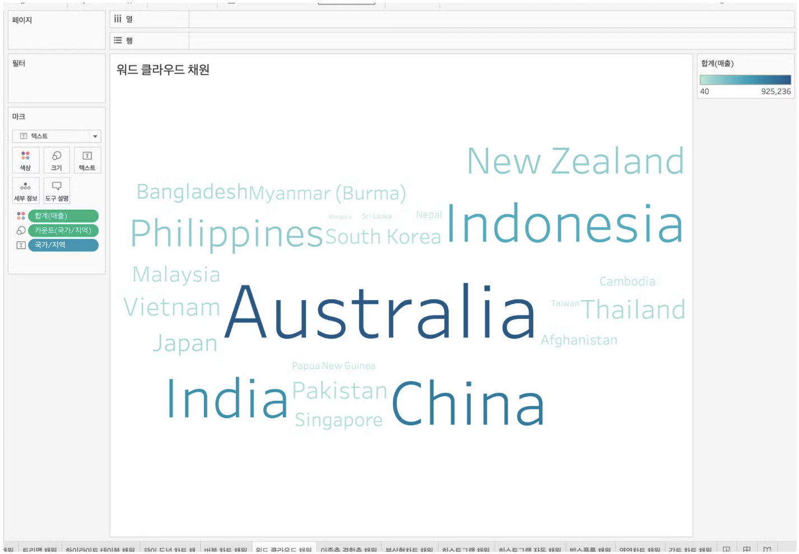


## 22강: 이중축과 결합축
<!-- 이중축과 결합축에 관해 배우게 된 점을 적어주세요 -->
```
이중축 쓸 때 마크에서 각각의 축을 설정 가능.
축 동기화 기능 활용하고, 머리글 표시를 해제하면 깔끔하게 한 그래프에 두 정보 담을 수 있음,
이중축은 마크 탭이 두 개 생기므로 각각을 관리 가능.

결합된 축은 수익 필드를 드래그 해서 초록색 박스가 생길 때 까지 가져가면 만들 수 있음. 
왼쪽에 초록 상자 2개 되는 곳에 그리면 결합축. 
결합된 축은 측정값 중 가장 큰 범위의 축을 공유함. 
하나의 마크창에 측정값 필드 안에 결합된 축이 들어있음.
```
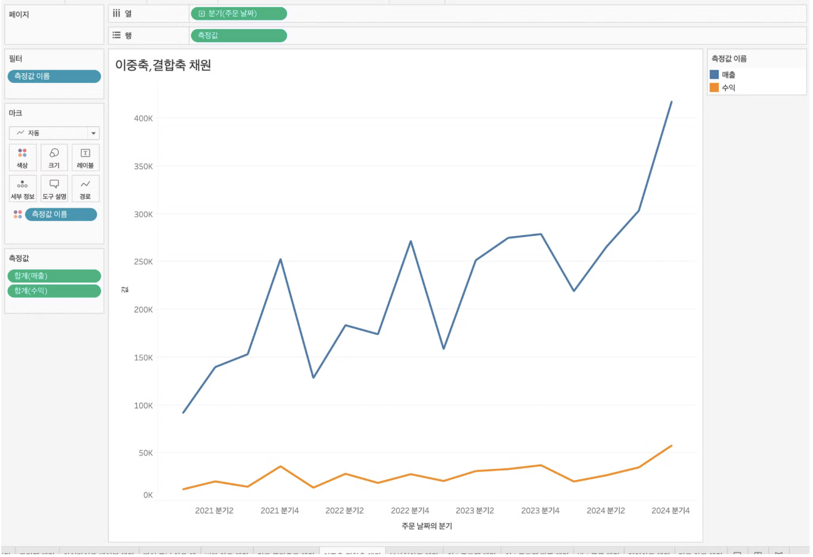

## 23강: 분산형 차트
<!-- 분산형 차트에 관해 배우게 된 점을 적어주세요 -->
```
분산형차트는 파라미터 간의 상관관계를 파악하는데 유용.
마크탭에서 세부정보란과 색깔 등을 활용해서 활용 가능.

추세선을 추가하면 좋음. 왼 쪽 상단 분석 탭에서 추세선을 드래그.

추세선 우클릭을 통해서 범주 체크 해제하면 전체 추세선 볼 수 있고, 
열 선반에 합계 복사 해서 두 개로 만든 다음 하나만 범주 체크하고 
이중축 설정하면 하나의 그래프에 전체 추세선과 범주별 추세선 둘 다를 나타낼 수 있음. 
하나는 머리글 해제 해주어서 깔끔하게 표현.
```
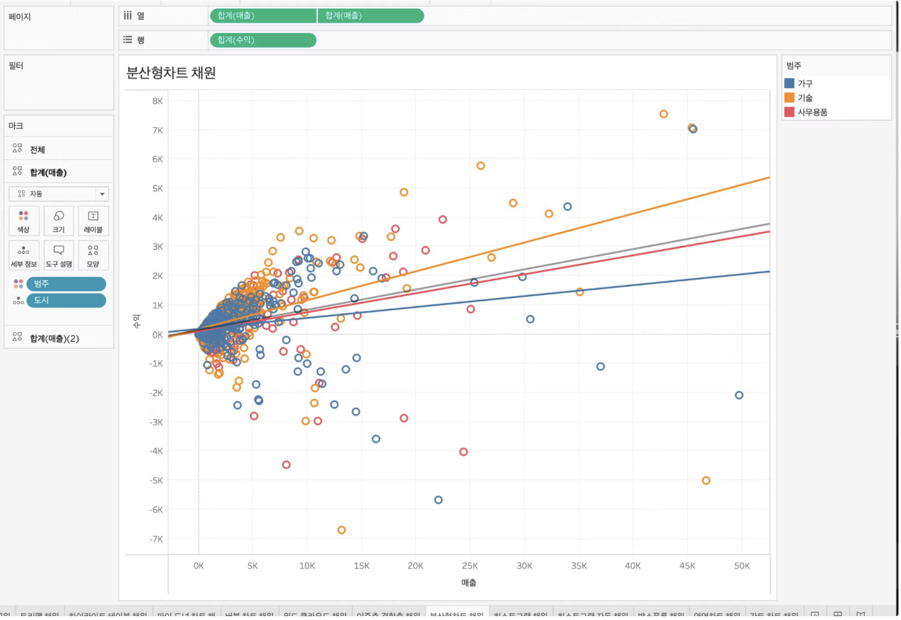

## 24강: 히스토그램
<!-- 히스토그램에 관해 배우게 된 점을 적어주세요 -->
```
막대그래프와 비슷하지만 불연속형이 아닌 연속형 측정값을 범위 혹은 구간 차원으로 그룹화 한다는 점에서 차이가 있음. 
차원 필드 없이 측정값 만으로 그래프를 그릴 때 주로 사용.

구간차원 생성. 매출 필드 마우스 우 클릭, 만들기에서 구간 차원 클릭. 구간별로 담을 포켓의 크기.

생성한 구간차원을 열선반으로.

카운트 고유는 중복값 제외.

표현 방식에서 히스토그램 선택하면 자동으로 수행되고, 축 편집이나 차원 편집 등을 통해 원하는 대로 편집할 수 있음.

히스토그램은 연속형 측정값을 통해 수치 데이터의 빈도를 표시하는 양적 데이터이고, 막대와 막대 사이가 붙어있다.

막대그래프는 불연속형 여러 범주의 데이터를 비교하기 위해 사용되고, 막대와 막대 사이 간격이 있음.
```
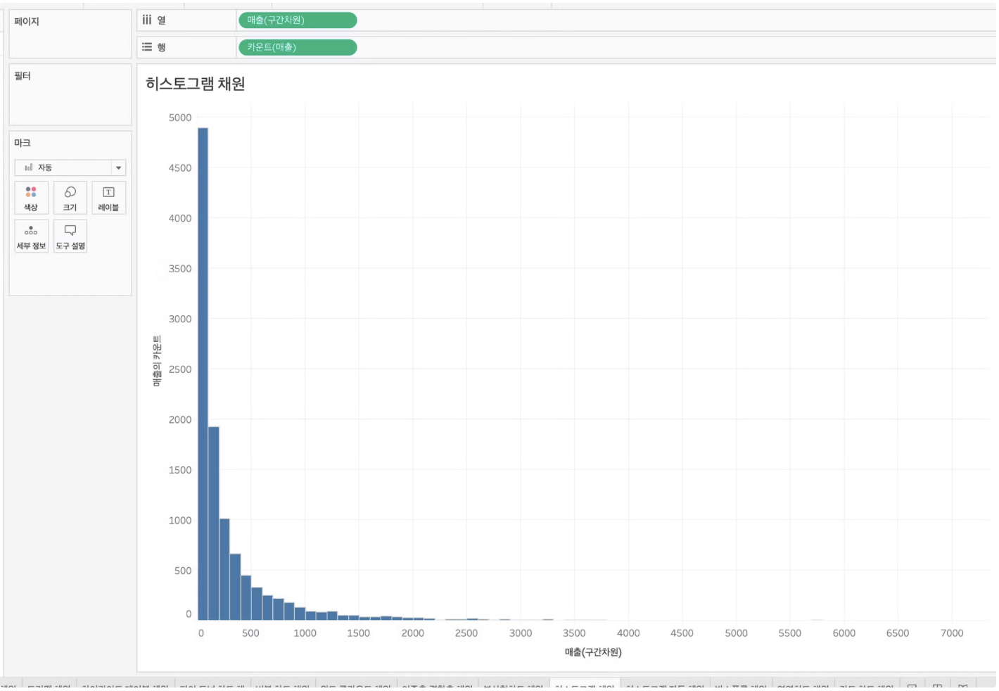
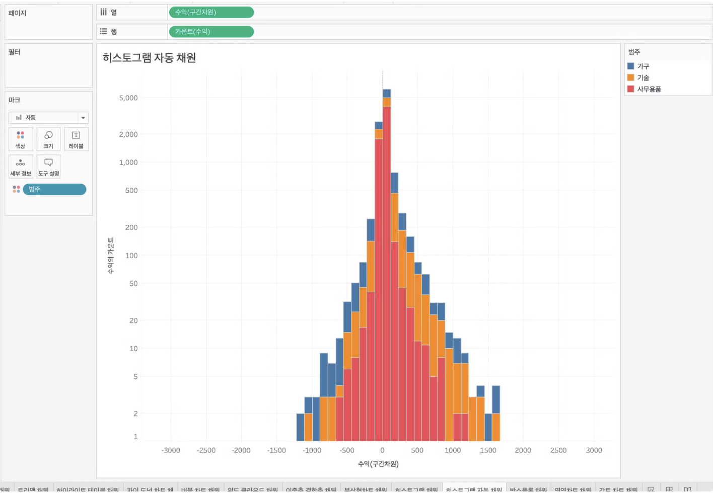

## 25강: 박스플롯
<!-- 박스플롯에 관해 배우게 된 점을 적어주세요 -->
```
박스플롯: 데이터의 분포를 파악하는 데 사용하는 그래프. 중앙값, Q1, Q3값, 안쪽 울타리, 바깥 울타리를 모두 표시함. 이상치도 함께 파악 가능.

표현 방식에서 박스플롯 선택하면 간단하게 만들 수 있고, 축편집 들어가서 로그로 표시하면 좀 더 효과적으로 시각화 가능.
```
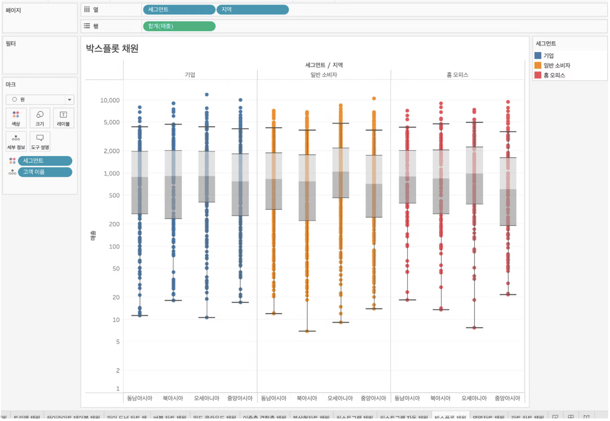

## 26강: 영역차트
<!-- 영역차트에 관해 배우게 된 점을 적어주세요 -->
```
영역차트는 라인과 축 사이의 공간이 색상으로 채워진 라인차트. 
주로 연속형 데이터의 누계, 세그먼트 드래그를 통해 순서 바꿀 수 있음.
```
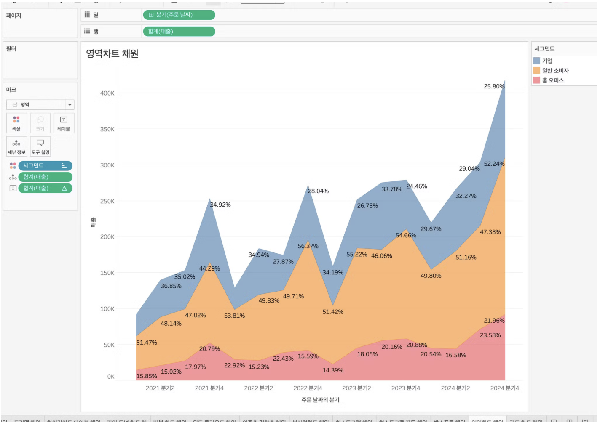

## 27강: 간트차트
<!-- 간트차트에 관해 배우게 된 점을 적어주세요 -->
```
간트차트는 그냥 보면 구분이 어렵기 때문에 적절한 필드를 
마크탭에 색상, 크기 등으로 끌어와서 
보기 편하게 설정해주는 것이 좋음.

필터 기능을 잘 활용하면 효과적으로 데이터 파악 가능.
```
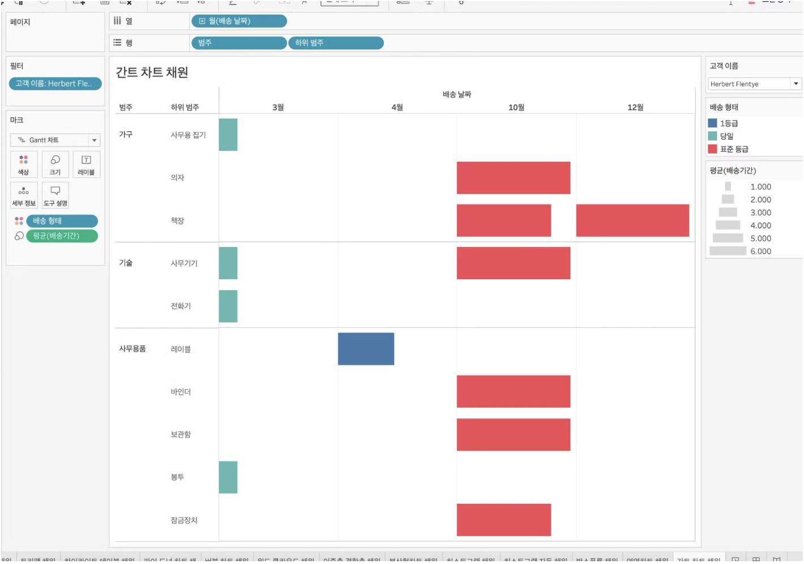

## 28강: 필터
<!-- 필터에 관해 배우게 된 점을 적어주세요 -->
```
컨텍스트 필터: 상위 필터. 다른 필터가 종속되어 작용함. 
필터에서 우클릭해서 컨텍스트로 설정 가능. 
회색으로 바뀌면서 재정렬 불가능. 

차원 필터: 비슷함. 필터 탭에서 편집 가능.
```

## 29강: 그룹
<!-- 그룹에 관해 배우게 된 점을 적어주세요 -->
```
드래그 해서 그룹화 하고,
필드에서 우클릭, 만들기, 그룹.
```
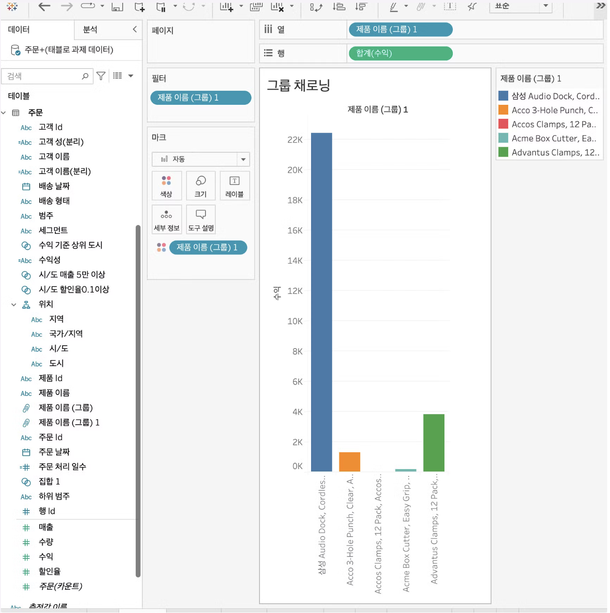

## 문제 1.

```js
유정이는 superstore 데이터셋에서 '주문' 테이블을 보고 있습니다.
1) 국가/지역 - 시/도- 도시 의 계층을 생성했습니다. 계층 이름은 '위치'로 설정하겠습니다.
2) 날짜의 데이터 타입을 '날짜'로 바꾸었습니다.

코로나 시기의 도시별 매출 top10을 확인하고자
1) 배송 날짜가 코로나시기인 2021년, 2022년에 해당하는 데이터를 필터링했고
2) 위치 계층을 행으로 설정해 펼쳐두었습니다.
이때, 매출의 합계가 TOP 10인 도시들만을 보았습니다.
```


```
겉보기에는 전체 10개로, 잘 나온 결과처럼 보입니다. 그러나 유정이는 치명적인 실수를 저질렀습니다.
오늘 배운 '컨텍스트 필터'의 내용을 고려하여 올바른 풀이 및 결과를 구해주세요.
```

<!-- DArt-B superstore가 아닌 개인 superstore 파일을 사용했다면 값이 다르게 표시될 수 있습니다.-->


컨텍스트 필터를 적용하지 않고 여러 필터를 동시에 작용하면 각각의 필터가 독립적으로 작용하게 됨.

위의 문제에서는 배송 날짜를 2021년과 2022년으로 필터링한 후, 매출의 합이 상위 10개인 도시를 선택하면,
상위 10개 도시는 2021년과 2022년의 매출 합을 기준으로 선정되는 것이 아니라, 모든 연도의 매출 합을 기준으로 선택됨.

즉, 현재 설정은 모든 연도의 매출 합을 기준으로 상위 10개 도시를 선택하고,
그 도시들의 2021년과 2022년 매출 합을 보여주고 있음.

따라서 처음에는 코로나 시기가 반영되지 않고, 전체 년도에 대한 매출 합계가 반영된 결과였을 것이다. 

배송 날짜 필터를 컨텍스트 필터로 설정하여, 2021년과 2022년 매출 합을 기준으로 상위 10개 도시를 비교할 수 있도록 우선적으로 적용되게 할 수 있음.


정답은 아래와 같음!
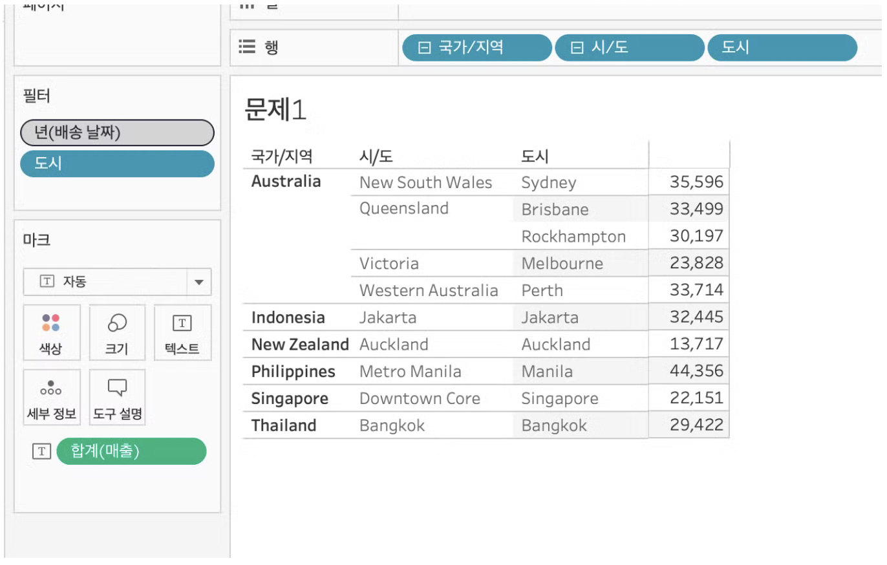

## 문제 2.

```js
태영이는 관심이 있는 제품사들이 있습니다. '제품 이름' 필드에서 '삼성'으로 시작하는 제품들을 'Samsung group'으로, 'Apple'으로 시작하는 제품들을 'Apple group'으로, 'Canon'으로 시작하는 제품들을 'Canon group'으로, 'HP'로 시작하는 제품들을 'HP group', 'Logitech'으로 시작하는 제품들을 'Logitech group'으로 그룹화해서 보려고 합니다. 나머지는 기타로 설정해주세요. 이 그룹화를 명명하는 필드는 'Product Name Group'으로 설정해주세요.

(이때, 드래그보다는 멤버 찾기 > 시작 문자 설정하여 모두 찾아 한번에 그룹화해 확인해보세요.)
```


```js
해당 그룹별로 어떤 국가/지역이 주문을 많이 차지하는지를 보고자 합니다. 매출액보다는 주문량을 보고 싶으므로, 주문Id의 카운트로 계산하겠습니다.

기타를 제외하고 지정한 5개의 그룹 하위 목들만을 이용해 아래와 같이 지역별 누적 막대그래프를 그려봐주세요.
```


1. 제품이름 우클릭 후 만들기 -> 그룹 -> 멤버 찾기 기능 이용해서 검색 후 그룹 버튼 누르기.
2. 그룹 이름 변경해주기.
   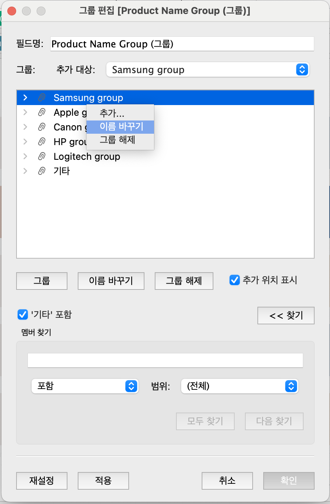

3. 만든 그룹에 필터 걸어주기.
    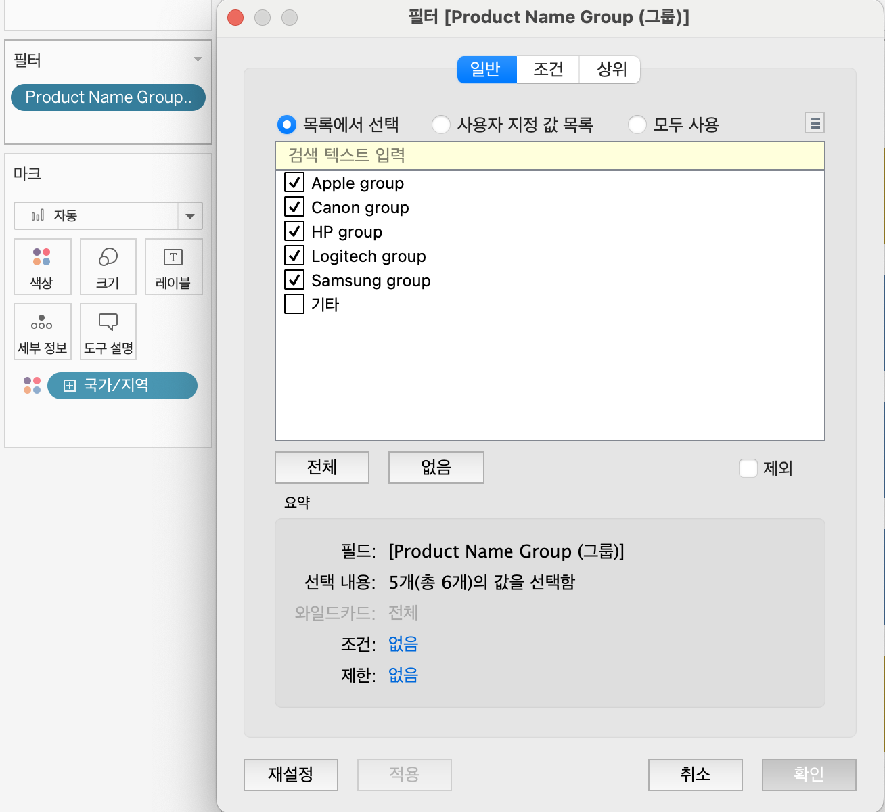

4. 주문 ID 열선반으로, 우클릭 후 측정값 카운트로.
5. 국가/지역 마크탭에 색상 필드로 드래그.
6. 상단에 전체보기로 바꿔주기.


    완성! 정답은 아래와 같습니당.
   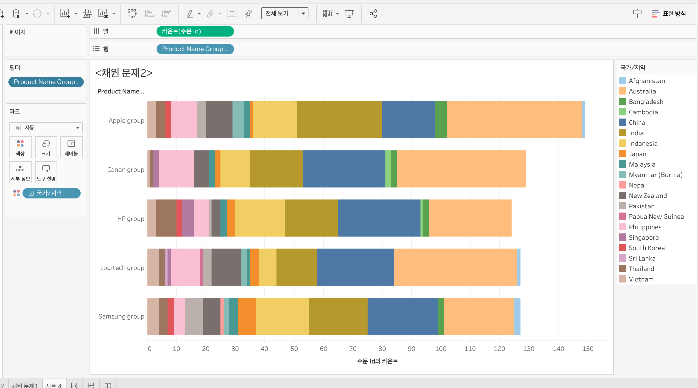