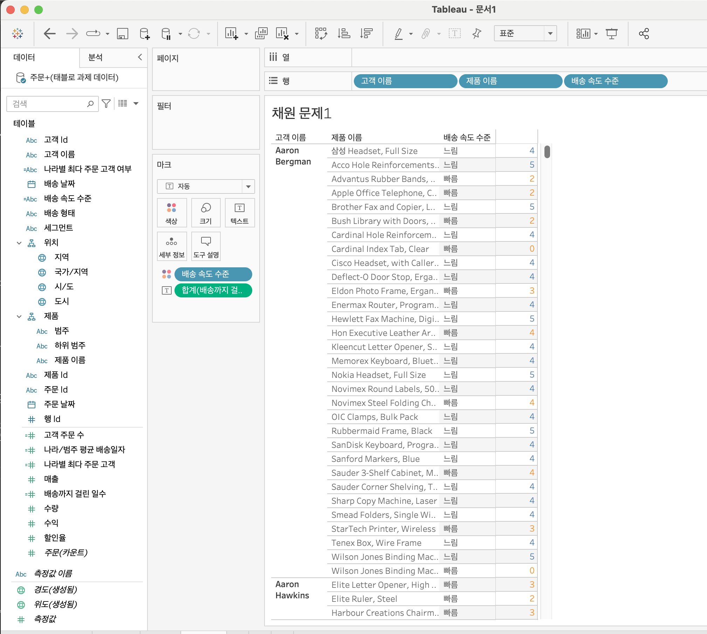

# Fifth Study Week

- 39강: [LOD](#39강-lod)

- 40강: [EXCLUDE](#40-lod-exclude)

- 41강: [INCLUDE](#41-lod-include)

- 42강 : [매개변수](#42-매개변수)

* (43강이 없어 패스합니다)
- 44강: [매개변수 실습](#44-매개변수-실습)

- 45강: [마크카드](#45-워크시트-마크카드)

- 46강: [서식계층](#46-서식-계층)

- 47강: [워크시트](#47-워크시트-서식)

- [문제1](#문제-1)

- [문제2](#문제-2)

- [문제3](#문제-3)

## Study Schedule

| 강의 범위     | 강의 이수 여부 | 링크                                                                                                        |
|--------------|---------|-----------------------------------------------------------------------------------------------------------|
| 1~9강        |  ✅      | [링크](https://www.youtube.com/watch?v=AXkaUrJs-Ko&list=PL87tgIIryGsa5vdz6MsaOEF8PK-YqK3fz&index=84)       |
| 10~19강      | ✅      | [링크](https://www.youtube.com/watch?v=AXkaUrJs-Ko&list=PL87tgIIryGsa5vdz6MsaOEF8PK-YqK3fz&index=75)       |
| 20~29강      | ✅      | [링크](https://www.youtube.com/watch?v=AXkaUrJs-Ko&list=PL87tgIIryGsa5vdz6MsaOEF8PK-YqK3fz&index=65)       |
| 30~38강      | ✅      | [링크](https://www.youtube.com/watch?v=e6J0Ljd6h44&list=PL87tgIIryGsa5vdz6MsaOEF8PK-YqK3fz&index=55)       |
| 39~47강      | 🍽️      | [링크](https://www.youtube.com/watch?v=AXkaUrJs-Ko&list=PL87tgIIryGsa5vdz6MsaOEF8PK-YqK3fz&index=45)       |
| 48~57강      | 🍽️      | [링크](https://www.youtube.com/watch?v=AXkaUrJs-Ko&list=PL87tgIIryGsa5vdz6MsaOEF8PK-YqK3fz&index=35)       |
| 58~67강      | 🍽️      | [링크](https://www.youtube.com/watch?v=AXkaUrJs-Ko&list=PL87tgIIryGsa5vdz6MsaOEF8PK-YqK3fz&index=25)       |
| 68~77강      | 🍽️      | [링크](https://www.youtube.com/watch?v=AXkaUrJs-Ko&list=PL87tgIIryGsa5vdz6MsaOEF8PK-YqK3fz&index=15)       |
| 78~85강      | 🍽️      | [링크](https://www.youtube.com/watch?v=AXkaUrJs-Ko&list=PL87tgIIryGsa5vdz6MsaOEF8PK-YqK3fz&index=5)        |


<!-- 여기까진 그대로 둬 주세요-->

> **🧞‍♀️ 오늘의 스터디는 지니와 함께합니다.**


## 39강. LOD

<!-- INCLUDE, EXCLUDE, FIXED 등 본 강의에서 알게 된 LOD 표현식에 대해 알게 된 점을 적어주세요. -->
fixed: 현재 뷰에 있는 차원과 상관없이 계산된 필드에서 원하는 차원을 따라 계산. 
   
 - fixed에서 설정한 차원이 뷰에 포함되어 있지 않아도 계산된 필드 설정에 따라 계산됨.
 - {FIXED[--]:SUM([--])} 이런 식으로 계산된 필드 만들기 해주면 됨!

EXCLUDE: 현재 뷰에서 특정 차원을 제외하여 계산할 때 사용.

ex. 액세서리 매출을 기준으로 계산된 필드를 생성하면, 다른 제품들은 액세서리 매출을 기준으로 정렬할 수 있음.

## 40. LOD EXCLUDE

<!-- INCLUDE, EXCLUDE, FIXED 등 본 강의에서 알게 된 LOD 표현식에 대해 알게 된 점을 적고, 아래 두 질문에 답해보세요 :) -->

> **🧞‍♀️ FIXED와 EXCLUDE을 사용하는 경우의 차이가 무엇인가요?**

```
FIXED는 현재 뷰와 관계없이 특정 차원을 사용해 계산하므로 필터에 영향 받지 않음.
EXCLUDE는 뷰에 있는 차원을 따라 계산하기 때문에 필터에 영향을 받음.
```

> **🧞‍♀️ 왜 ATTR 함수를 사용하나요?**

```
 ATTR 함수는 그룹의 모든 행에 대해 단일 값만 포함하면 주어진 식의 값을 반환하고, 그렇지 않으면 별표(*)를 표시.
 강의에서 사용된 'SUM([매출]) - ATTR([EXCLUDE 하위 범주 매출])'에서, 
 ATTR은 'EXCLUDE 하위 범주 매출'이 단일값임을 확인하고자 사용되었음.
```


## 41. LOD INCLUDE

<!-- INCLUDE, EXCLUDE, FIXED 등 본 강의에서 알게 된 LOD 표현식에 대해 알게 된 점을 적고, 아래 두 질문에 답해보세요 :) -->
INCLUDE: 집계 계산을 수행할 때 뷰의 기존 차원에 더하여 특정 차원을 포함시켜 집계를 계산.
즉, 뷰에 나타나는 차원들과 함께 지정된 차원을 추가로 포함하여 계산 수행.

> **🧞‍♀️ 그렇다면 어떤 경우에 각 표현식을 사용하나요? 예시와 함께 적어보아요**


```
뷰에 표시되는 값이 차원이면, FIXED LOD 표현식만 사용 가능. -> 차원과 측정값 반환 가능. 차원 필터에 영향 받지 않음.
INCLUDE와 EXCLUDE LOD 표현식은 측정값만 반환. 반환 값이 차원 값에 영향을 받는 경우에 . 이표현식 사용해야 함.
```

## 42. 매개변수

<!-- 매개변수에 대해 알게 된 점을 적어주세요 -->
고정된 상수값이 아닌 동적인 값으로 변경하기 위해 사용하는 기능.
매개변수는 반드시 계산식, 필터, 또는 참조선과 함께 사용.
필터, 필드 우클릭, 데이터 패널을 통해 매개변수 만들기 가능.

> **🧞‍♀️ 집합에도 매개변수를 적용할 수 있나요? 시도해봅시다**


## 44. 매개변수 실습
(43번 강의가 없어 패스합니다)

<!-- 매개변수에 대해 알게 된 점을 적어주세요 -->
참조선 사용.
분석-참조선-테이블 드래그 앤 드롭, 라인 값-새 매개 변수 만들기->값 입력하면 참조선 설정됨


## 45. 워크시트 마크카드

<!-- 마크카드에 대해 알게 된 점을 적어주세요 -->
마크의 서식 변경을 위해 마크카드 사용. 마크 유형 변경을 위해 드롭 다운 선택하고 변경 가능.
색상-후광: 맵에서 사용, 지정한 색 후광이 마크를 둘러쌈.

## 46. 서식 계층

<!-- 서식계층에 대해 알게 된 점을 적어주세요 -->
서식 계층구조는 워크 시트 서식, 행/열 서식, 특정 필드, 필드 레이블, 도구설명/제목/마크 서식들이 있음.
아래 계층에서 설정한 서식이 적용됨.
상위 계층에서 설정한 서식은 하위 서식에 영향을 미치지 않음.
서식 필드 상단 필드에서 변경, 혹은 뷰에서 마우스 우클릭해서 서식 클릭해서 변경 가능.

> **🧞‍♀️ 서식계층을 일반적인 것에서 구체적인 것 순서로 기입해보세요**


```
워크 시트 서식
행/열 서식
특정 필드
필드 레이블
도구 설명/제목/마크
```


## 47. 워크시트 서식

<!-- 워크시트 서식에 대해 알게 된 점을 적어주세요!-->
글꼴, 맞춤, 음영 서식
상단 서식 탭을 통해 워크시트 직관적 디자인 가능.
글꼴에서 글꼴, 색상, 크기 설정.
맞춤에서 정렬과 방향 설정.
음영에서 워크시트 내 표시된 셀에 음영 행/열 색상 교차 가능. 크기도 조절 가능!


## 문제 리스트


## 문제 1.

```
가장 많이 주문한 사람들은 물건 배송을 빨리 받았을까요?
조건을 준수하여 아래 이미지를 만들어봆시다.
1) 국가/지역별(이하 '나라'로 통칭), 범주별로 배송일자가 다를 수 있으니 먼저, 나라별/범주별로 평균 배송일자를 설정한 뒤,
2) 각 나라에서 가장 많이 주문한 사람의 이름을 첫 번째 열,
3) 그 사람이 주문한 제품 이름을 2번째 열,
4) 각 상품이 배송까지 걸린 날 수를 표현하고
5) 그리고 만약 배송이 각 나라/범주별 평균보다 빨랐다면 '빠름', 같다면 '평균', 느리다면 '느림' 으로 print 해주세요. 
```


<!-- 여기까지 오는 과정 중 알게 된 점을 기입하고, 결과는 시트 명을 본인 이름으로 바꾸어 표시해주세요.-->

계산된 필드를 총 3개를 만들어야 함.


## 문제 2.

```
채원이는 태블로를 쓰실 수 없는 상사분께 보고하기 위한 대시보드를 만들고 싶어요. 

제품 중분류별로 구분하되 매개변수로써 수익, 매출, 수량을 입력하면 저절로 각각 지표에 해당하는 그래프로 바뀌도록 설계하고자 해요.

 어떤 값이 각 지표의 평균보다 낮은 값을 갖고 있다면 색깔을 주황색으로, 그것보다 높다면 파란색으로 표시하고 싶어요. 그 평균값은 각 지표별로 달라야 해요.
```


<!-- 예시 사진은 지워주세요-->