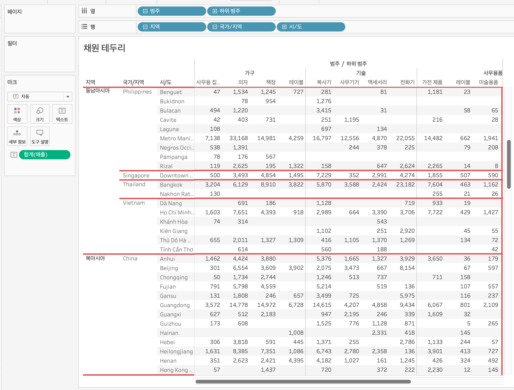

# Sixth Study Week


## Study Schedule
<br>

| 회차 | 강의 범위   | 강의 이수 여부 | 링크                                                                                                     |
|------|-------------|----------------|--------------------------------------------------------------------------------------------------------|
| 1    | 1~7강       | ✅              | [링크](https://www.youtube.com/watch?v=AXkaUrJs-Ko&list=PL87tgIIryGsa5vdz6MsaOEF8PK-YqK3fz&index=84)    |
| 2    | 8~17강      | ✅              | [링크](https://www.youtube.com/watch?v=AXkaUrJs-Ko&list=PL87tgIIryGsa5vdz6MsaOEF8PK-YqK3fz&index=75)    |
| 3    | 18~27강     | ✅              | [링크](https://www.youtube.com/watch?v=AXkaUrJs-Ko&list=PL87tgIIryGsa5vdz6MsaOEF8PK-YqK3fz&index=65)    |
| 4    | 28~37강     | ✅              | [링크](https://www.youtube.com/watch?v=e6J0Ljd6h44&list=PL87tgIIryGsa5vdz6MsaOEF8PK-YqK3fz&index=55)    |
| 5    | 38~47강     | ✅              | [링크](https://www.youtube.com/watch?v=AXkaUrJs-Ko&list=PL87tgIIryGsa5vdz6MsaOEF8PK-YqK3fz&index=45)    |
| 6    | 48~57강     | ✅              | [링크](https://www.youtube.com/watch?v=AXkaUrJs-Ko&list=PL87tgIIryGsa5vdz6MsaOEF8PK-YqK3fz&index=35)    |
| 7    | 58~67강     | 🍽️             | [링크](https://www.youtube.com/watch?v=AXkaUrJs-Ko&list=PL87tgIIryGsa5vdz6MsaOEF8PK-YqK3fz&index=25)    |
| 8    | 68~77강     | 🍽️             | [링크](https://www.youtube.com/watch?v=AXkaUrJs-Ko&list=PL87tgIIryGsa5vdz6MsaOEF8PK-YqK3fz&index=15)    |
| 9    | 78~85강     | 🍽️             | [링크](https://www.youtube.com/watch?v=AXkaUrJs-Ko&list=PL87tgIIryGsa5vdz6MsaOEF8PK-YqK3fz&index=5)     |
---

<br/>
<!-- 여기까진 그대로 둬 주세요-->

> **🧞‍♀️ 오늘은 강의보다 실습과 대시보드 직접 만들기가 더 중요하니, 기록보다는 사고하며 강의를 들어주세요.**

## 48. 워크시트 서식(2)

<!-- 워크시트에 관해 본 강의에서 알게 된 점을 적어주세요 -->

서식 탭 -> 테두리 선택

테두리 유형, 두께, 색상 선택 가능함.

행 구분선의 수준에 따라 테두리가 자동으로 다르게 설정됨을 확인 가능.

ex.



## 49강. 대시보드패널

<!-- 대시보드패널 강의에서 알게 된 점을 적어주세요. -->
```
새 대시보드 만들기를 하면 대시보드 패널과 대시보드 디자인 페이지가 생김.

크기 항목: 대시보드의 크기 설정.
고정된 기본 크기, 자동 크기, 범위 설정 가능.

시트 항목에서 사용 가능한 워크시트들 확인 가능.
새로운 워크시트 만들면 시트 항목에 자동 추가.
시트 드래그, 드롭하여 추가 가능.

개체에서 태블로가 지원하는 것들 추가 가능.

기기 미리보기 선택하고 해상도 조절을 통해 원하는 크기로 대시보드 변경, 배치 가능.

```
## 50. 대시보드 구성방식

<!-- 알게 된 점을 적고, 아래 질문에 답해보세요 :) -->

> **🧞‍♀️ 부동과 바둑판식 방식을 차이를 중점으로 기술해보세요**
```
바둑판식: 격자무늬 구조에 따라 객체 구성 가능. 대시보드 크기가 자주 변경될 때 추천. 변경되어도 개체가 유사한 형식 유지 가능.

부동: 객체를 사용자가 원하는대로 자유롭게 배치 가능. 다른 개체의 크기, 모양에 영향을 주지 않음. 
개체를 shift 누른 상태에서 drag and drop 하면 부동식으로 객체 추가됨.
대시보드 크기가 자주 변경되지 않고, 대시보드 내에 빈 공간이 많을 때 추천.
```


## 51. 대시보드 컨테이너
```
컨테이너 : 대시보드 개체들과 워크시트들을 그룹화하고 구성할 수 있는 공간
- 가로 컨테이너 : 내부의 개체들을 수평 공간으로 배열할 때 사용
- 세로 컨테이너 : 내부의 개체들을 수직 공간으로 배열할 때 사용
```

## 52. 레이아웃 패널
```
대시보드의 개체 속성 변경 가능.
그래프 클릭하고 레이아웃 탭 클릭하면 변경 옵션 확인 가능.

레이아웃 패널에서 변경 가능한 옵션 종류
- 제목
- 부동 여부
- 위치
- 크기
- 테두리
- 백그라운드
- 여백
- 항목 계층(해당 대시보드의 컨테이너와 개체 확인 가능)
```

## 53. 필터 동작

<!-- 필터 동작에 대해 알게 된 점을 적어주세요 -->
```
선택할 사항이 많을 때는 드롭다운 보다 대시보드 동작을 사용하는 것이 효율적일 것.
대시보드 탭에 동작 클릭.

동작 추가 중 필터 동작 선택.
맵 필터
: 맵 차트 -> 필터 -> 세그먼트 : 세그먼트별로 선택하면 맵 차트에 세그먼트별로 나타남
: 원본 시트에서 선택했을 때 필터를 할 시트를 선택
: 대상 시트에서 선택했을 때 필터링 될 시트를 선택
```

## 54. 대시보드 하이라이터 동작

<!-- 하이라이터에 대해 알게 된 점을 적어주세요 -->
```
하이라이트 동작 : 대시보드에서 데이터를 선택했을 때 하이라이트로 구분할 수 있음.

분산형 차트 먼저 만들고, 원본 시트에서 선택할 시트 선택.
이후 대상 시트에서 하이라이트로 표시될 시트 선택.
```

## 55. 대시보드 URL

<!-- URL에 대해 알게 된 점을 적어주세요 -->
```
URL : 대시보드에서 클릭 등의 동작을 통해 바로 웹 사이트로 이동할 수 있음.
원본 시트에 URL을 삽입할 시트를 선택해주고, 
URL 동작 추가를 해주면 됨.
선택한 필드명을 항상 들어가게 하려면 <필드명> 삽입해주기.
제목에도!
```

## 56. 대시보드 시트에 이동 동작

<!-- 대시보드 시트에 이동에 대해 알게 된 점을 적어주세요!-->
```
1. 시트에서 이동 동작으로 이동될 시트를 새로운 대시보드에 생성해준다.
2. 원본 시트에서 선택할 시트를 선택한다.
3. 대상 시트에서 이동될 시트를 선택한다.
4. 필터 동작 설정을 완료하면 이동했을 때, 선택된 국가별로 데이터가 나오게 된다.
5. 다시 원래 대시보드로 돌아가기 위해 '탐색' 개체를 삽입해줄 수 있다. (편집 단추 생성. ALT + 탐색 개체 누르기)
```

## 57. 매개변수 변경 동작

<!-- 매개변수 변경 동작에 대해 알게 된 점을 적어주세요!-->
```
```

## 문제

오늘은 별도의 문제가 없습니다. 


여러 대시보드를 참고하시어, superstore 데이터를 사용해 나만의 대시보드를 제작해주세요.

**단, 워크시트 3개 이상의 그래프를 표시해야 하며 각 시트 간 상호작용성 필터 or 하이라이트 동작은 꼭 추가되어야 합니다**

어떤 부분에 가중을 두었는지, 어떤 사용자 편의성을 고려하였는지에 대한 설명이 필요합니다.