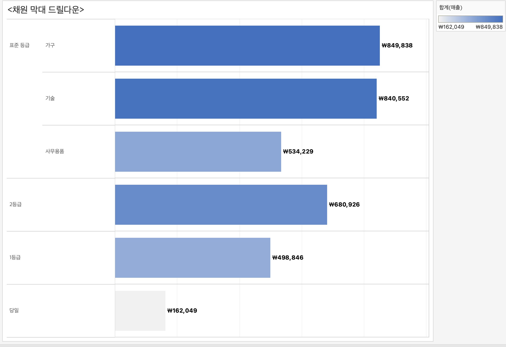

# 7th Study Week

## Study Schedule
<br>

| 회차 | 강의 범위   | 강의 이수 여부 | 링크                                                                                                     |
|------|-------------|----------------|--------------------------------------------------------------------------------------------------------|
| 1    | 1~7강       | ✅              | [링크](https://www.youtube.com/watch?v=AXkaUrJs-Ko&list=PL87tgIIryGsa5vdz6MsaOEF8PK-YqK3fz&index=84)    |
| 2    | 8~17강      | ✅              | [링크](https://www.youtube.com/watch?v=AXkaUrJs-Ko&list=PL87tgIIryGsa5vdz6MsaOEF8PK-YqK3fz&index=75)    |
| 3    | 18~27강     | ✅              | [링크](https://www.youtube.com/watch?v=AXkaUrJs-Ko&list=PL87tgIIryGsa5vdz6MsaOEF8PK-YqK3fz&index=65)    |
| 4    | 28~37강     | ✅              | [링크](https://www.youtube.com/watch?v=e6J0Ljd6h44&list=PL87tgIIryGsa5vdz6MsaOEF8PK-YqK3fz&index=55)    |
| 5    | 38~47강     | ✅              | [링크](https://www.youtube.com/watch?v=AXkaUrJs-Ko&list=PL87tgIIryGsa5vdz6MsaOEF8PK-YqK3fz&index=45)    |
| 6    | 48~57강     | ✅              | [링크](https://www.youtube.com/watch?v=AXkaUrJs-Ko&list=PL87tgIIryGsa5vdz6MsaOEF8PK-YqK3fz&index=35)    |
| 7    | 58~66강     | ✅             | [링크](https://www.youtube.com/watch?v=AXkaUrJs-Ko&list=PL87tgIIryGsa5vdz6MsaOEF8PK-YqK3fz&index=25)    |
| 8    | 67~77강     | 🍽️             | [링크](https://www.youtube.com/watch?v=AXkaUrJs-Ko&list=PL87tgIIryGsa5vdz6MsaOEF8PK-YqK3fz&index=15)    |
| 9    | 78~85강     | 🍽️             | [링크](https://www.youtube.com/watch?v=AXkaUrJs-Ko&list=PL87tgIIryGsa5vdz6MsaOEF8PK-YqK3fz&index=5)     |
---

<br/>

> **🧞‍♀️ 오늘은 강의보다 실습과 대시보드 직접 만들기가 더 중요하니, 기록보다는 사고하며 강의를 들어주세요.**

## 58. 집합값 변경

<!-- 집합값 변경 강의에서 알게 된 점을 적어주세요 -->
```
집합 값 변경 동작: 차트에서 요소를 클릭했을 때 요소의 하위 범주 및 관련 데이터를 표시할 수 있음.
만들어진 집합에 포함되는 필드를 변경함으로써 작동함.

대시보드에 동작 -> 동작 추가에 집합 동작 추가.

클릭하면 해당하는 하위 범주의 값을 보여줌.
```


## 59강. 스토리패널

<!-- 스토리패널 강의에서 알게 된 점을 적어주세요 -->
```
스토리텔링을 위한 것.
책 모양 아이콘을 눌러 스토리 생성.
스토리 패널 + 스토리 워크시트 페이지.
스토리 각각의 개별 시트를 스토리 포인트라고 함.

스토리 패널은 스토리의 여러 설정을 할 수 있음.
크기, 시트 드래그, 제목, 서식 등등..

스토리 툴 바: 탐색기 영역을 마우스 오버할 때 나타남, 변경된 내용을 되돌리기, 스토리 포인트에 대한 업데이트 적용, 삭제 및 생성 가능.

탐색기: 스토리 포인트를 편집하고 구성할 수 있음, 사용자가 탐색기를 이용해서 스토리 단계 이동이 가능함. 탐색기 스타일 레이아웃 패널에서 변경 가능.
```


## 60. 스토리

<!-- 알게 된 점을 적고, 아래 질문에 답해보세요 :) -->
```
생성한 워크시트와 대시보드에 설명을 덧붙여 데이터를 설명하거나 정보를 전달하고 의사결정에 도움을 주고 설득력 있는 사례를 구성하는 등의 기능을 구현하는 작업이 가능함.
```


## 61. 대시보드 탐색

<!-- 대시보드 탐색 강의에서 알게 된 점을 적어주세요 -->
```
이미지 개체 드래그해서 편집.
색상 및 여백 설정 해주기.
탐색 개체 추가해주고, 빈 페이지는 제거.
이미지 추가 삽입.
대시보드 복제 후 이름 변경.
필요한 차트 삽입, 제목 수정.
같은 방식으로 다른 차트들도 추가.
각 차트별로 탐색 버튼의 경로를 대시보드로 설정.
```

## 62. 태블로 단추

<!-- 태블로 단추 강의에서 알게 된 점을 적어주세요 -->
```
지도 그래프의 "표시/숨기기 단추" 추가.
Alt를 누른 채 버튼을 누르면 지도 그래프가 숨겨짐.
"표시/숨기기 단추" 부동 해제 후 제목 옆으로 이동.

단추 스타일과 단추 모양, 이미지 선택 및 이미지 편집 가능.
표시된 항목을 "활성화", 숨겨진 항목을 "비활성화" 이미지로 변경하여 따로 설정 가능.
```


## 63. 막대그래프 드릴다운

<!-- 막대그래프 드릴다운에 대해 알게 된 점을 적어주세요 -->
```
막대 그래프 제작 후
드릴 다운 제작을 위한 매개변수 생성.

IF문을 활용해 "배송 형태"가 "매개 변수 Level 1"과 일치할 경우 "범주"로 드릴다운, 
그렇지 않을 경우 다시 "배송 형태"로 돌아오는 계산된 필드 생성.

그 후 매개변수를 활용하여 동작 설정해주기.
```


## 64. 트리맵 드릴다운

<!-- 트리맵 드릴다운에 대해 알게 된 점을 적어주세요 -->
```
드릴다운이 카테고리 - 서브 카테고리 - 제조업체 순서로 이루어지도록하는 트리맵.
```

여기서 Technology 클릭하면~~

요렇게 됨!

## 65. 파이 차트 드릴다운

<!-- 파이 차트 드릴다운에 대해 알게 된 점을 적어주세요 -->
```
필드들 더블클릭해서 파이차트 생성.
카테고리 집합 생성해주고,
계산된 필드 생성.(드릴다운 1)
계산된 필드 이용해서 드릴다운 동작 생성.
필드 세부정보 마크에서 설정.
이중축 설정으로 크기가 다른 파이차트 2개 만들고, 
테두리 등 서식 편집 해주기.
```

여기서 Office Supplies 클릭하면~~

요렇게 됨~!


## 66. 지도 드릴다운

<!-- 지도 드릴다운에 대해 알게 된 점을 적어주세요 -->
```
지도맵 제작하고 드릴다운 제작용 매개변수 생성.
동작 설정.
드릴다운으로 국가 -> 시도로 이어지는 맵 제작.
```

여기서 Austrailia 클릭하면~~

요렇게 됨!!


---

